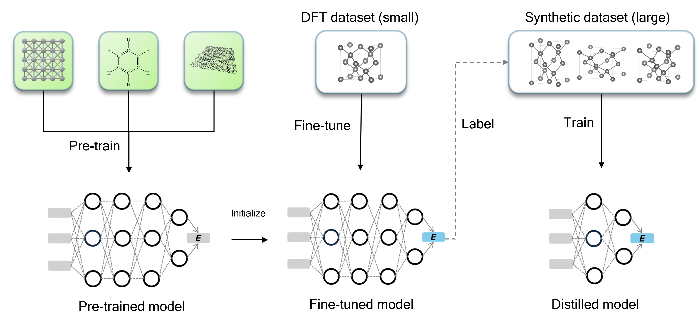
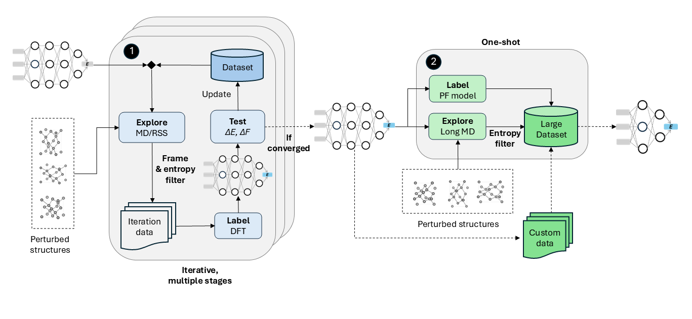

# PFD-kit: finetune and distillation from pre-trained atomic models

[PFD-kit](https://github.com/ruoyuwang1995nya/dp-distill) is a cloud-base workflow for generating of deep-learning force fields from *pre-trained* atomic models (**P**) through fine-tuning (**F**) and distillation (**D**). Compared to training force fields from scratch, PFD requires significantly less training data by leveraging transferable knowledge from large pre-trained model. This reduces computational cost by an order of magnitude, making PFD well-suited for high-throughput calculations.

The workflow is especially useful for complex systems (*e.g.*, high-entropy alloys, surfaces/interfaces) that are traditionally difficult to model. With its cloud-ready design, PFD-kit can be a powerful tool for computational materials science. </div>

For complete tutorials and user guide, please refer to our [Online Documentation](https://pfd-kit.readthedocs.io/en/latest/)

> PFD-kit is bulit on the [dflow](https://github.com/dptech-corp/dflow.git) package and incorporates components of [DPGEN2](https://github.com/deepmodeling/dpgen2) workflow. PFD-kit currently supports the **Deep Potential** and **MatterSim** (only fine-tuning) models, with additional models (e.g. **MACE**) planned.

## Table of Contents
- [PDF-kit: Workflow for finetune and fast distillation]
  - [1. Overview](#1-overview)
  - [2. Installation](#2-installation)
  - [3. Quick Start](#3-quick-start)

## 1. Overview
PFD-kit provides an automated workflow for generating machine-learning force fields from pre-trained atomic models via fine-tuning and knowledge distillation.
<div style="text-align: center;">
    
</div>

### Fine-tuning
The PFD workflow begins with a pre-trained large atomic model (LAM) such as `DPA`, `Mattersim`, *etc*. Fine-tuning adapts the model to specific material domains with far less data than traditional from-scratch training. This greatly reduces computational cost while enabling accurate predictions for materials with highly complex structures and chemistries.

### Knowledge Distillation
While fine-tuned models are accurate, their large architectures can be inefficient for large-scale simulations. To address this, PFD-kit applies *knowledge distillation*: a lightweight model is trained on data generated and labeled by the fine-tuned model. The distilled model achieves similar accuracy within the target domain but runs much faster during inference.    

### Automation and Efficiency
PFD-kit automates the entire fine-tuning and distillation process. It includes data-selection algorithms that maximize efficiency using entropy-based measures of atomic environments. Built on `dflow`, it supports both local and cloud execution.

<div style="text-align: center;">
    
</div>

## 2. Installation
PFD-kit can be built and installed form the source.
```shell
pip install git+https://github.com/ruoyuwang1995nya/pfd-kit.git
```

## 3. Quick start
PFD jobs can be submittied through command line interface using the `submit` subcommand: 
```shell
pfd submit input.json
```
PFD-kit supports two major types of workflow, **fine-tuning** and **distillation**, and the workflow parameters are defined in the `input.json` script. Users also need to prepare required input files such as pre-trained model files, material structure files, training scripts, *etc*. For a complete guide on the PFD-kit usage and explanation of input script, please refer to the online documentation.  

## Citing 
If you use PFD-kit in a publication, please cite the following paper:
```bibtex
@article{wang2025pfd,
  title = {Pre-training, fine-tuning, and distillation (PFD): Automatically generating machine learning force fields from universal models},
  author = {Wang, Ruoyu and Gao, Yuxiang and Wu, Hongyu and Zhong, Zhicheng},
  journal = {Phys. Rev. Mater.},
  volume = {9},
  issue = {11},
  pages = {113802},
  numpages = {11},
  year = {2025},
  month = {Nov},
  publisher = {American Physical Society},
  doi = {10.1103/sbz6-btz8},
  url = {https://link.aps.org/doi/10.1103/sbz6-btz8}
}
```