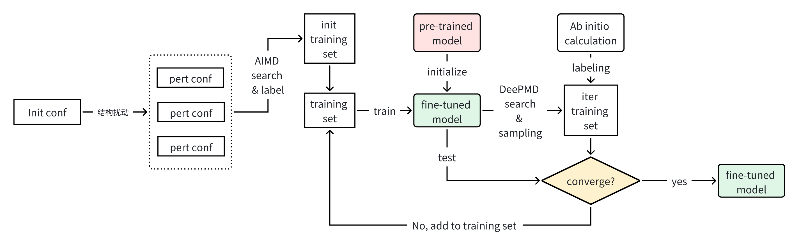

# PFD-kit: finetune and distillation from pre-trained atomic models
[PFD-kit](https://github.com/ruoyuwang1995nya/dp-distill) automates the fine-tuning and distillation process of pre-trained atomic models. It enables practical atomistic simualtion with the highly transferable, but computationally expensive pre-trained models. PFD-kit is built upon the [dflow](https://github.com/dptech-corp/dflow.git) package and includes components of [DPGEN2](https://github.com/deepmodeling/dpgen2) workflow. Currently, PFD-kit supports the Deep Potential models.

> Online documentation is [here](https://ruoyuwang1995nya.github.io/pfd-kit/)

## Table of Contents
- [PDF-kit: Workflow for finetune and fast distillation]
  - [1. Overview](#1-overview)
  - [2. Installation](#2-installation)
  - [3. Quick Start](#3-quick-start)
  - [4. User Guide](#4-user-guide)

## 1. Overview
Inspired by DPGEN concurrent learning scheme, PFD-kit provides automated workflow for efficient model fine-tuning and distillation for practical application of pre-trained model in *atomic simulation*. Fig.1 shows the schematic of fine-tuning workflow. Given the initial structures of fine-tuning systems, the workflow generates perturbed structures, and executes a series of short *ab initio* molecular dynamics (AIMD) simulation based upon randomly perturbed structures. The pre-trained model is firstly fine-tuned by the AIMD dataset, then MD simulation with the fine-tuned model searches new configurations, which are then labeled by first-principle calculation softwares. If the fine-tuned model cannot predict the labeled dataset with sufficient accuracy, the collected dataset would be added to the fine-tuning training set, and the *train-search-label* process would iterate until convergence. 
<div>
    
    <p style='font-size:1.0rem; font-weight:none'>Figure 1. Fine-tune workflow.</p>
</div>

A lightweight model can be generated from a fine-tuned model through distillation, which enables much faster simulation. The distilled model can be generated with training data labeled by the fine-tuned model. Figure 2 shows the schematic of the distillation workflow.
 <div>
    
    <p style='font-size:1.0rem; font-weight:none'>Figure 2. Distillation workflow.</p>
</div>

## 2. Installation
PFD-kit can be built and installed form the source.
```shell
git clone https://github.com/ruoyuwang1995nya/pfd-kit.git
cd pfd-kit && pip install .
```

## 3. Quick start
PFD-kit comes with a simple CLI interface. For instance, a finetune workflow can be submitted using following command:
```shell
pfd submit finetune.json
```
The `finetune.json` specifies imput parameters of the finetune task, whose details can be found in the online [documentation](https://ruoyuwang1995nya.github.io/pfd-kit/). 

## 4. Userguide
Examples of json input file for model fine-tune and distillation can be found in the `examples` directory. The complete documentation of the latest version PFD-kit can be found [here](https://ruoyuwang1995nya.github.io/pfd-kit/)