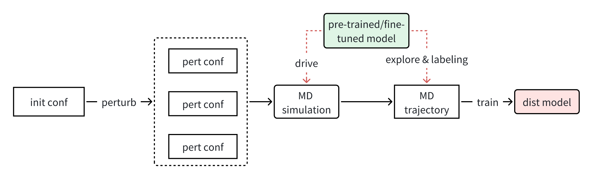

# DP-DISTILL: fine-tune and distillation kit for pre-trained Deep Potential models
[DP-distill](https://github.com/ruoyuwang1995nya/dp-distill) automates the fine-tune and distillation process which enables practical atomistic simualtion with the highly transferable, but also computationally expensive DPA-2 pre-trained models. DP-distill is currently built upon the  [DPGEN2](https://github.com/deepmodeling/dpgen2) workflow.

## Table of Contents

- [DP-distill: Battery simulation workflow automation](#voltcraft-battery-simulation-workflow-automation)

  - [1. Overview](#1-overview)
  - [2. Installation](#2-installation)
  - [3. Quick Start](#3-quick-start)
  - [4. User Guide](#4-user-guide)


## 1. Overview
Inspired by the DPGEN concurrent learning scheme, DP-distill provides automated workflow for fine-tune and distillation of large pre-trained model. 

Currently, only the distillation workflow has been implemented, and the fine-tune workflow is in development. With DP-distill kit, a standard DeePMD model can be generated from a pre-trained/fine-tuned platform model by model distillation. Compared to training from scratch using the standard DPGEN process, a DeePMD model of comparable accuracy can be obtained with almost an order of magnitude less GPU resources and negligible CPU cost, provided that a well-converged DPA-2 platform model is availiable.   

Below is a schematic showing the basic distillation workflow.
 <div>
    
    <p style='font-size:1.0rem; font-weight:none'>Figure 1. Distillation workflow.</p>
</div>

## 2. Installation
DP-distill can be built and installed form the source. First clone the package by
```shell
git clone https://github.com/ruoyuwang1995nya/dp-distill.git
```

then install by
```shell
cd dp-distill && git checkout devel
pip install .
```

## 3. Quick start
DP-distill can be accessed from Python API. A workflow would be submitted by running following Python script.
```python
from distill.entrypoint.submit import submit_dist
import json
with open("example.json",'r') as fp:
    config_dict=json.load(fp)
wf=submit_dist(
        config_dict,
        )
wf.submit()
```

## 4. Userguide
An example of json input file can be found in the "examples" directory. 