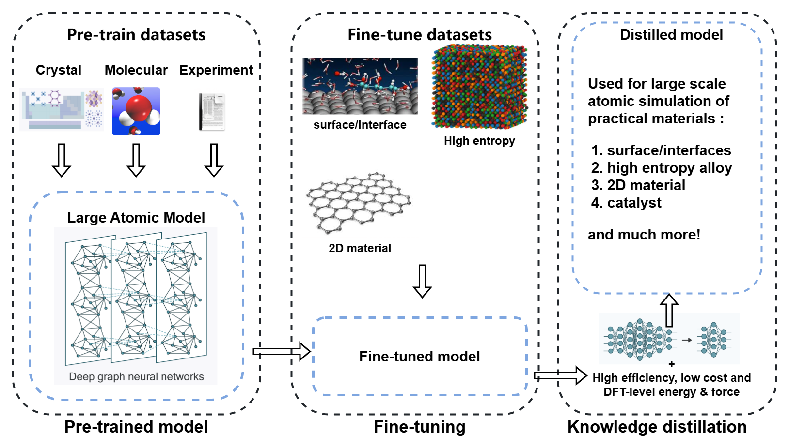

# PFD-kit: finetune and distillation from pre-trained atomic models
> **⚠️ Warning:**  
> The latest version of `PFD-kit` has been restructured to integrate with the ASE package, offering enhanced functionality and compatibility with modern workflows. Users are encouraged to transition to this updated version for the best experience. For those who wish to access the older version of PFD-kit, it remains available.

[PFD-kit](https://github.com/ruoyuwang1995nya/dp-distill) is a cloud-base workflow automating the generation of deep-learning based force fields from *pre-trained* atomic models (**P**) through fine-tuning (**F**) and distillation (**D**) for large scale atomic simulation of practical materials. Compared to training force fields from scratch, model generation using PFD workflow requires much less training data by exploiting the transferable knowledge already in the pre-trained model, saving significant time and computational resources by an order of magnitude. This makes the PFD workflow ideal for high-throughput calculations and addresses challenges in training force fields for complex material systems (*e.g.*, high-entropy alloys, surfaces/interfaces) that are previously intractable. With its easy-to-use interface and cloud-base feature, PFD-kit can be a powerful tool for researchers in computational materials science. </div>

For complete tutorials and user guide, please refer to our [Online Documentation](https://ruoyuwang1995nya.github.io/pfd-kit/)

> PFD-kit is bulit upon is built upon the [dflow](https://github.com/dptech-corp/dflow.git) package and includes components of [DPGEN2](https://github.com/deepmodeling/dpgen2) workflow. Currently, PFD-kit only supports the **Deep Potential** models.

## Table of Contents
- [PDF-kit: Workflow for finetune and fast distillation]
  - [1. Overview](#1-overview)
  - [2. Installation](#2-installation)
  - [3. Quick Start](#3-quick-start)
  - [4. User Guide](#4-user-guide)

## 1. Overview
Inspired by DPGEN concurrent learning scheme, PFD-kit provides automated workflow to efficient machine-learning force fields from pre-trained atomic model through fine-tuning and knowledge distillation. A general conception of the PFD workflow is shown below:
<div style="text-align: center;">
    
</div>

At the basis of PFD workflow is a large atomic model (LAM) pre-trained on large numbers of quantum mechanical calculation of materials across vast chemical space, such as DPA-2, *etc*. Thanks to the transferable knowledge in the pre-trained LAM, fine-tuning from LAM can achieve high accuracy on user-specific materials domains with much less training data compared to traditional from-scratch method. This not only saves significantly computational resources, but also enable accurate prediction on practical materials of extremely complex structural and chemical compositions.  

Usually, the fine-tuned model inherits the sophiscated structure of the pre-trained LAM, which is largely redundant given the much narrower material domains. Thus a lightweight model with fewer parameters can trained with datas generated and labeled using the fine-tuned model through a process known as *knowledge distillation*. The end model is almost as accurate as the fine-tuned model within the given materials domain, but runs much more efficiently in large scale atomic simulations that are essential to modern material research and development.    

## 2. Installation
PFD-kit can be built and installed form the source.
```shell
pip install git+https://github.com/ruoyuwang1995nya/pfd-kit.git
```

## 3. Quick start
PFD jobs can be submittied through command line interface using the `submit` subcommand: 
```shell
pfd submit input.json
```
PFD-kit supports two major types of workflow, **fine-tuning** and **distillation**, and the workflow parameters are defined in the `input.json` script. Users also need to prepare required input files such as pre-trained model files, material structure files, training scripts, *etc*. For a complete guide on the PFD-kit usage and explanation of input script, please refer to the online documentation.  
